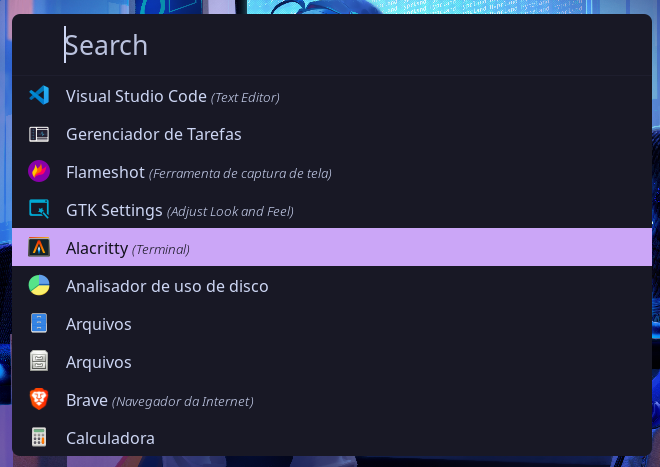
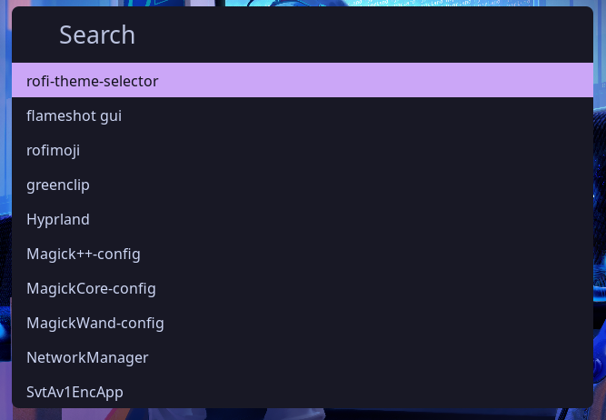
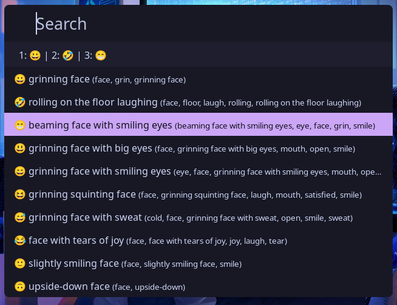

# spotlight-catppuccin-mocha-theme-rofi

Catppuccin Mocha theme for Rofi inspired by macOS Spotlight.







## How to use

1. Clone the project [rofi-themes-collection](https://github.com/newmanls/rofi-themes-collection) and follow the instructions;
2. Clone this repo;
3. Copy the `spotlight-catppuccin-mocha.rasi` to the theme folder
  ```shell
  cd spotlight-catppuccin-mocha-theme-rofi
  ```
  ```shell
  cp ./spotlight-catppuccin-mocha.rasi ~/.local/share/rofi/themes
  ```
